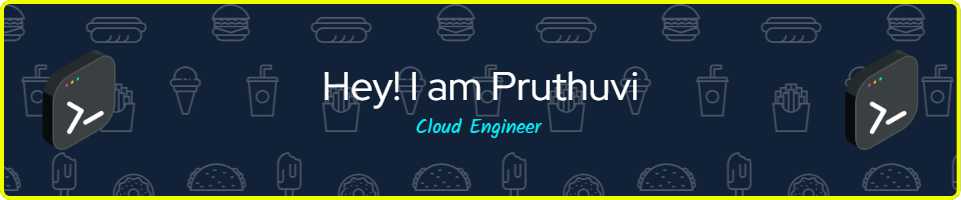

<!-- Header Section -->
<div align="center">
  
</div>

<h1 align="center">Hey! 👋 I'm Pruthuvi De Silva</h1>

<h3 align="center">☁️ Cloud Engineer | 💻 Backend Developer | .NET Expert</h3>

<p align="center">
  <em>Building scalable cloud solutions & passionate about clean code</em>
</p>

---

<!-- Social Links -->
<p align="center">
  <a href="https://twitter.com/pruthuvide" target="_blank" rel="noopener noreferrer">
    
  </a>
  <a href="https://linkedin.com/in/pruthuvide" target="_blank" rel="noopener noreferrer">
    
  </a>
  <a href="https://instagram.com/pruthuvide" target="_blank" rel="noopener noreferrer">
    
  </a>
  <a href="https://youtube.com/@pruthuvide" target="_blank" rel="noopener noreferrer">
    
  </a>
  <a href="https://medium.com/@pruthuvide" target="_blank" rel="noopener noreferrer">
    
  </a>
  <a href="https://dev.to/pruthuvide" target="_blank" rel="noopener noreferrer">
    
  </a>
</p>

---

## 🚀 About Me

```
👨‍💻 Backend Developer specializing in .NET & Cloud Engineering
☁️  Passionate about building scalable cloud solutions
🎓 Undergraduate Student @ Coventry | BSc (Hons) Computing
📍 Based in Colombo, Sri Lanka
💡 Enthusiast for clean code and best practices
```

---

## 💼 Tech Stack

<div align="center">

### Languages


### Cloud & Tools


</div>

---

## 📊 GitHub Statistics

<div align="center">
  
  
</div>

<div align="center">
  
</div>

---

## 🎯 Featured Projects

<div align="center">

### 🤖 Arduino Line Following Robot
[](https://github.com/pruthuvide/Arduino-Line-Following-Obstacle-Avoiding-Robot)

### 🔐 uBlock
[](https://github.com/pruthuvide/uBlock)

### ✈️ Travel Lanka Website
[](https://github.com/pruthuvide/Travel-Lanka-Website)

### 👥 First Contributions
[](https://github.com/pruthuvide/first-contributions)

</div>

---

## 🏆 Achievements & Highlights

<div align="center">
  
  
  
  **4** followers • **7** following  
  **National Institute of Business Management**

</div>

---

## 💬 Inspiration

> "The most important single aspect of software development is to be clear about what you are trying to build."
>
> — **Bjarne Stroustrup**

---

## 📬 Get In Touch

<div align="center">

**Feel free to reach out to me!**

📧 **Email:** [pruthuvide@outlook.com](mailto:pruthuvide@outlook.com)  
🌐 **Website:** [pruthuvide.github.io](https://pruthuvide.github.io)  

### Support My Work

<a href="https://www.buymeacoffee.com/pruthuvide" target="_blank">
  
</a>

</div>

---

<div align="center">
  
  
  
</div>
